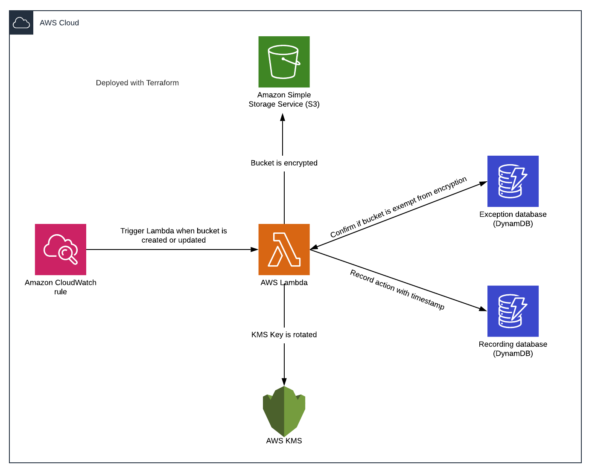

# Auto-drift encryption of AWS S3 - Security Guide
This security guide shows you how to create automated remediation infrastructure in AWS that continuously checks for create and update S3 bucket events which result in unencrypted S3 buckets (or encrypted in a non-standard way) and automatically encrypts them per compliance guidelines. This infrastructure also includes an exception mechanism to put exceptions on S3 buckets which do not need to be encrypted for a time-bound duration. The infrastructure also identifies if any S3 bucket is encrypted with a KMS key “not” enabled for auto-rotation and enables that feature. All of the actions performed by the solution is recorded in a DynamoDB database with timestamps.

Automated compliance solutions offered:

1. Encryption at-rest for S3 buckets
2. Enablement of auto rotation of KMS keys used for encryption of S3 buckets

Below is a conceptual diagram for this solution: 

## Resources Created
The following resources would be created as part of this code:

    1. *CloudWatch Event rule* - Triggers Lambda whenever S3 bucket is created or its configuration modified
    2. *AWS IAM Role* - Role attached to Lambda function
    3. *AWS IAM Policy* - Policy attached to above role
    4. *Lambda Function* - Performs the event-driven Compute of the infrastructure
    5. *Exception database (DynamoDB)* - Stores S3 bucket name and expiry time for exceptions
    6. *Recording Database (DynamoDB)*  - Records all actions performed by the Lambda function
    7. *KMS CMEK 1* - For encrypting S3 bucket
    8. *KMS CMEK 2* - For encrypting Lambda environment variables and the DynamoDB tables

## Customize the parameters
1. Update the names of AWS resources if required by updating the terraform.tfvars
2. If exceptions are needed for S3 bucket, please update the terraform.tfvars file location as below:

{"sample-s3-bucket"="12/31/20 00:00","sample2-s3-bucket2"="None"}

Please note the format for the Expiry has to be in the same format as mentioned above. If no expiry timestamp needs to be mentioned, then “None” should be mentioned. Do not leave this field blank.

## Next Steps

The solution can be updated to include other resources as well like encryption for databases - RDS, DynamoDB and also entirely different compliance controls like - enablement of S3 access logging. 

